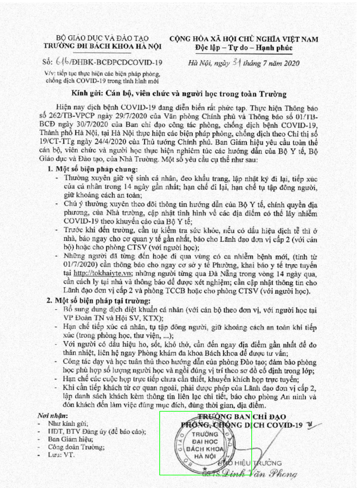
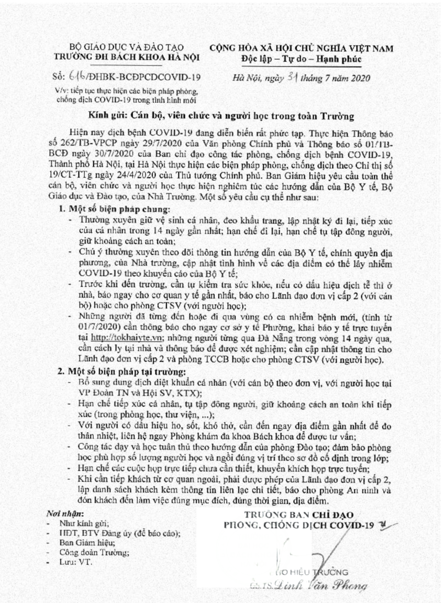

## Example usage

First install `pdf2image` to convert pdf to images
`pip install pdf2image`

Manually download the weight or see below to download the weight automatically
* [Stamp detector](https://drive.google.com/file/d/1YHH7pLoZEdyxw2AoLz9G4lrq6uuxweYB/view?usp=sharing)
* [Stamp remover](https://drive.google.com/file/d/1fQGVnatgHcMTmOxswqhE-vqoF_beovs1/view?usp=sharing)
### Stamp detector 
Initialize StampDetector
```python
from stamp_processing import StampDetector
detector = StampDetector(model_path=None)
```
You can set the model path to `None` to automatically download the weight or manually download the weight at the link above.
Detect stamp from images:
```python
import numpy as np
import matplotlib.pyplot as plt
import pdf2image
import cv2
from stamp_processing.detector import StampDetector

def imshow(img, figsize=(10, 10)):
    fig, ax = plt.subplots(1, 1, figsize=figsize)
    ax.axis('off')
    ax.imshow(img)

detector = StampDetector(model_path=None)

images = pdf2image.convert_from_path('sample.pdf')
image = np.array(images[0])
preds = detector.detect([image])
for box in preds[0]:
    cv2.rectangle(image, (box[0], box[1]), (box[2], box[3]), (0, 255, 0), 255)
imshow(image)
```



### Stamp Remover
Set the correct path if you have already downloaded the weight or set both path to `None` to download
```python
import numpy as np
import matplotlib.pyplot as plt
import pdf2image
import cv2
from stamp_processing import StampRemover

def imshow(img, figsize=(10, 10)):
    fig, ax = plt.subplots(1, 1, figsize=figsize)
    ax.axis('off')
    ax.imshow(img)

remover = StampRemover(detection_weight=None, removal_weight=None)
images = pdf2image.convert_from_path('sample.pdf')
image = np.array(images[0])
preds = remover([image])
imshow(preds[0])
```

